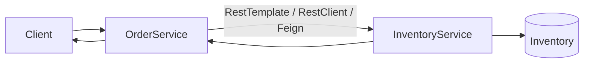
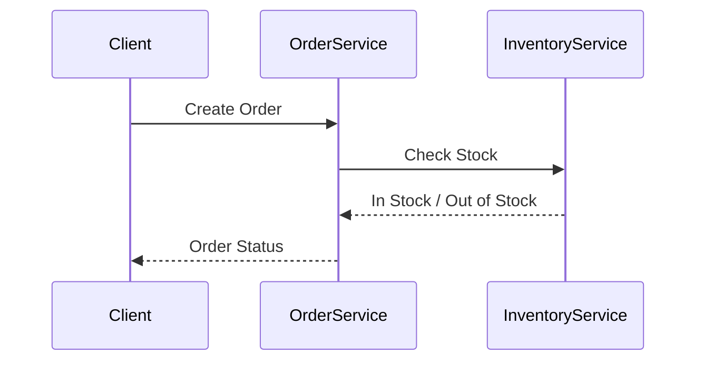

# Microservices Communication Study

A Spring Boot project demonstrating **synchronous communication** between microservices using three different client implementations:

- 🔴 RestTemplate *(Deprecated)*
- 🟢 RestClient *(Spring Boot 3.2+ Recommended)*
- 🔵 OpenFeign *(Declarative HTTP Client)*

The project simulates an **Order Service** communicating with an **Inventory Service** to verify product availability before placing an order.

---

## Concepts Covered

- Microservices Architecture
- Synchronous Service-to-Service Communication
- REST APIs
- RestTemplate (Legacy)
- RestClient (Modern Alternative)
- OpenFeign Client
- Service Layer Separation
- Spring Boot 3

---

## Project Structure

```
Microservices-Communication-Study
│
├── inventory-service
│   ├── controller
│   ├── service
│   ├── model
│   └── repository
│
├── order-service
│   ├── controller
│   ├── service
│   ├── client
│   │   ├── RestTemplateClient
│   │   ├── RestClientClient
│   │   └── FeignClient
│   └── model
│
└── README.md
```

---

## Communication Flow



---

## Request Sequence



---

## HTTP Client Comparison

| Client | Status | Best Use |
|---------|--------|----------|
| RestTemplate | Deprecated | Legacy applications |
| RestClient | Recommended | Modern synchronous communication |
| OpenFeign | Recommended | Declarative microservice communication |

---

## Tech Stack

- Java 21
- Spring Boot
- Spring Web
- Spring Cloud OpenFeign
- Maven

---

## Learning Outcome

This project demonstrates how the same business workflow can be implemented using three different synchronous HTTP clients in Spring Boot while highlighting the evolution from **RestTemplate** to **RestClient** and the simplicity of **FeignClient** for inter-service communication.
