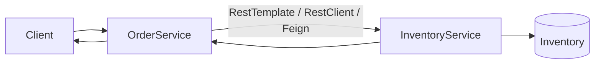
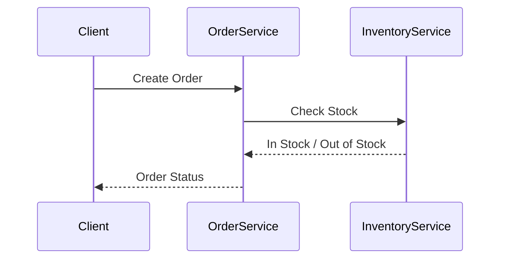
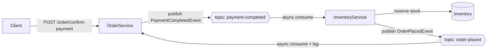
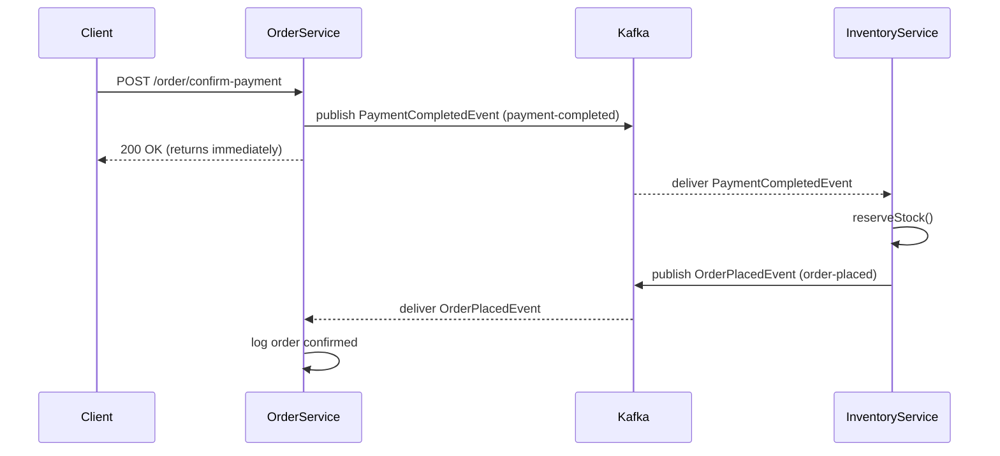

# Microservices Communication Study

A Spring Boot project demonstrating **synchronous communication** between microservices using three different client implementations:

- 🔴 RestTemplate *(Deprecated)*
- 🟢 RestClient *(Spring Boot 3.2+ Recommended)*
- 🔵 OpenFeign *(Declarative HTTP Client)*

The project simulates an **Order Service** communicating with an **Inventory Service** to verify product availability before placing an order.

---

## Concepts Covered

- Microservices Architecture
- Synchronous Service-to-Service Communication
- REST APIs
- RestTemplate (Legacy)
- RestClient (Modern Alternative)
- OpenFeign Client
- Service Layer Separation
- Spring Boot 3

---

## Project Structure

```
Microservices-Communication-Study
│
├── docker-compose.yml                     # new — local single-node Kafka broker (KRaft)
│
├── inventory-service
│   ├── controller
│   ├── service                            # + reserveStock() for async stock updates
│   ├── model
│   ├── repository
│   ├── event                              # new — Kafka message payloads
│   │   ├── PaymentCompletedEvent
│   │   └── OrderPlacedEvent
│   └── kafka                              # new — async subscriber
│       └── PaymentEventListener
│
├── order-service
│   ├── controller
│   ├── service
│   │   ├── OrderService
│   │   └── CommunicationDispatcher        # new — runtime REST vs Kafka router
│   ├── client
│   │   ├── RestTemplateClient
│   │   ├── RestClientClient
│   │   └── FeignClient
│   ├── model
│   ├── event                              # new — payloads + mode enums
│   │   ├── PaymentCompletedEvent
│   │   ├── OrderPlacedEvent
│   │   ├── OrderEventType
│   │   └── CommunicationMode
│   └── kafka                              # new — publisher + subscriber
│       ├── OrderEventPublisher
│       └── OrderPlacedListener
│
└── README.md
```

---

## Communication Flow



---

## Request Sequence



---

## HTTP Client Comparison

| Client | Status | Best Use |
|---------|--------|----------|
| RestTemplate | Deprecated | Legacy applications |
| RestClient | Recommended | Modern synchronous communication |
| OpenFeign | Recommended | Declarative microservice communication |

---

## Tech Stack

- Java 21
- Spring Boot
- Spring Web
- Spring Cloud OpenFeign
- Maven

---

## Learning Outcome

This project demonstrates how the same business workflow can be implemented using three different synchronous HTTP clients in Spring Boot while highlighting the evolution from **RestTemplate** to **RestClient** and the simplicity of **FeignClient** for inter-service communication.

---
---

# Extension: Event-Driven Communication with Apache Kafka

> Added on the `Rest+Event-Driven-Comm` branch.

The project has been extended to demonstrate **asynchronous, event-driven communication** using **Apache Kafka**, running *alongside* the existing synchronous REST communication. Both modes now **coexist**, and the mode is chosen **at runtime based on the type of event**.

## Why Two Modes?

| Business Event | Needs an immediate answer? | Communication Mode | Mechanism |
|----------------|:--------------------------:|--------------------|-----------|
| **Placing an order** → inventory stock check | ✅ Yes | **Synchronous** | REST (`RestClient`) |
| **Confirming an order** → after payment | ❌ No (fire-and-forget) | **Asynchronous** | Kafka (publish/subscribe) |

A stock check must block for a yes/no answer, so REST fits. Payment confirmation is a notification that can be processed independently, so Kafka fits — the caller returns instantly while inventory reacts on its own thread.

---

## Runtime Mode Selection

Each business event is bound to a communication mode via an enum, and a **dispatcher** reads that binding at runtime to route the call:

```
OrderEventType.ORDER_PLACEMENT      -> CommunicationMode.SYNCHRONOUS_REST   -> RestClient call
OrderEventType.PAYMENT_CONFIRMATION -> CommunicationMode.ASYNCHRONOUS_KAFKA -> Kafka publish
```

The controller never decides *how* to communicate — it only names the event, and `CommunicationDispatcher` picks the mechanism.

---

## Kafka Event Flow



## Async Sequence



---

## New Components

**order-service (publisher + return-leg subscriber)**
- `event/PaymentCompletedEvent`, `event/OrderPlacedEvent` — message payloads
- `event/OrderEventType`, `event/CommunicationMode` — bind an event to its comm mode
- `service/CommunicationDispatcher` — the runtime router (REST vs Kafka)
- `kafka/OrderEventPublisher` — publishes to `payment-completed`
- `kafka/OrderPlacedListener` — consumes `order-placed`

**inventory-service (subscriber + republisher)**
- `event/PaymentCompletedEvent`, `event/OrderPlacedEvent`
- `kafka/PaymentEventListener` — consumes `payment-completed`, reserves stock, publishes `order-placed`
- `service/InventoryService#reserveStock()` — decrements stock transactionally

---

## Kafka Topics

| Topic | Producer | Consumer | Purpose |
|-------|----------|----------|---------|
| `payment-completed` | order-service | inventory-service | Payment done → finalize order |
| `order-placed` | inventory-service | order-service | Stock reserved → confirm to order-service |

---

## Running Locally

**1. Start a single-node Kafka broker** (KRaft mode, no ZooKeeper) via the provided `docker-compose.yml`:

```bash
# Docker
docker compose up -d

# Podman
podman compose up -d
```

**2. Start both services** (ports `8080` and `8081`), e.g. from IntelliJ or:

```bash
cd order-service && ./mvnw spring-boot:run
cd inventory-service && ./mvnw spring-boot:run
```

---

## API Endpoints

| Method | Endpoint | Mode | Description |
|--------|----------|------|-------------|
| `POST` | `/inventory` | — | Seed stock: `{"productId":1,"quantity":10}` |
| `POST` | `/order/{productId}` | 🟢 Synchronous REST | Place order — immediate stock check |
| `POST` | `/order/confirm-payment` | 🔵 Asynchronous Kafka | Confirm after payment (fire-and-forget) |

**Async request body** (`/order/confirm-payment`):

```json
{ "orderId": "ORD-100", "productId": 1, "quantity": 2, "amount": 49.99 }
```

---

## Added Tech Stack

- Apache Kafka (KRaft mode)
- Spring for Apache Kafka (`spring-kafka`)
- Docker / Podman (local broker)

---

## Extended Learning Outcome

This extension shows how a single system can support **both synchronous and asynchronous communication simultaneously**, selecting the right mechanism per event at runtime — REST for request/response stock checks, and Kafka for decoupled, event-driven order confirmation.
